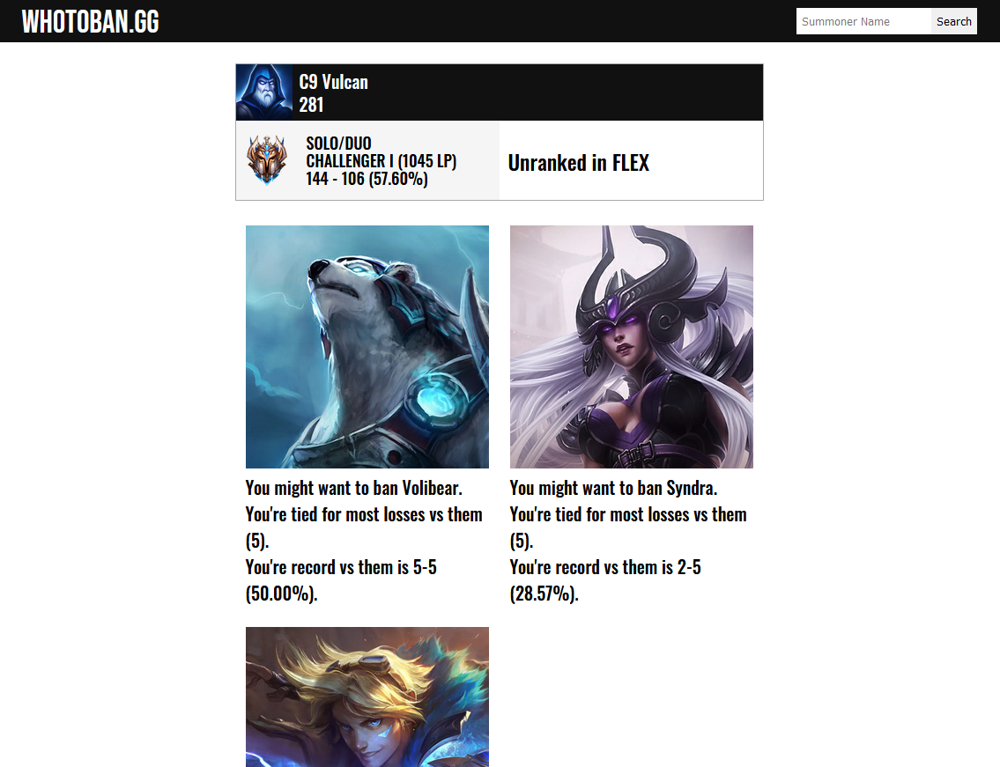
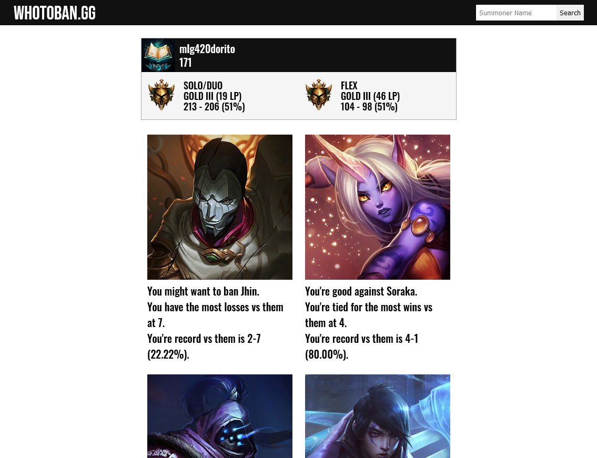
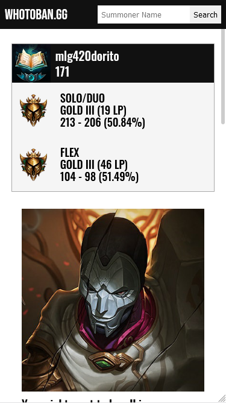
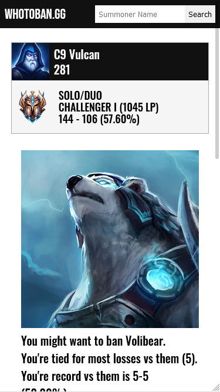

# WhoToBan
League of Legends application telling players who to ban based off of who they win or lose against the most.

This does not include a riot games API so you would have to acquire your own key to get it to work.